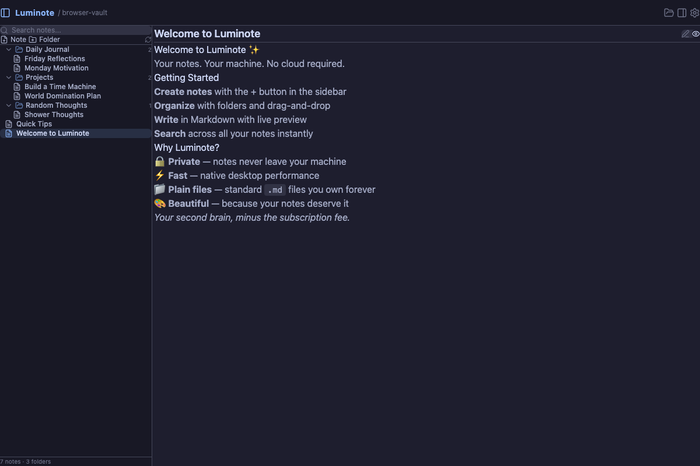

# Luminote

An open-source, local-first note-taking app built with Tauri, React, and TypeScript. Designed as a fast, lightweight alternative to Obsidian.



## Features

- **Local-first** — Your notes live on your machine as plain Markdown files. No account required.
- **CodeMirror 6 editor** — Fast markdown editing with syntax highlighting, bracket matching, and line numbers.
- **WikiLinks** — `[[note]]` support with autocomplete, inline highlighting, and click-to-navigate.
- **Live preview** — Toggle between edit and rendered Markdown views.
- **File tree** — Folder management with drag & drop, context menus, and keyboard navigation.
- **Search** — Real-time note search with match highlighting (`Cmd/Ctrl+P`).
- **Themes** — Light, Dark, and System themes using the Catppuccin color palette.
- **Settings** — Configurable editor font, size, line height, auto-save interval, and more.
- **Toast notifications** — Inline feedback for all file operations.
- **Keyboard shortcuts** — Full shortcut reference via `?` key.

## Tech Stack

| Layer    | Technology              |
| -------- | ----------------------- |
| Desktop  | Tauri 2                 |
| Frontend | React 19 / TypeScript   |
| Editor   | CodeMirror 6            |
| Build    | Vite 7                  |
| Styling  | TailwindCSS 4           |
| State    | Zustand                 |
| Icons    | Lucide React            |
| Markdown | react-markdown          |
| Toasts   | sonner                  |
| Testing  | Vitest + Testing Library|

## Prerequisites

- [Node.js](https://nodejs.org/) 18+
- [pnpm](https://pnpm.io/) 8+
- [Rust](https://rustup.rs/) (latest stable) — only needed for desktop builds
- Platform-specific Tauri dependencies — see [Tauri prerequisites](https://v2.tauri.app/start/prerequisites/)

## Getting Started

```bash
# Clone the repository
git clone https://github.com/d-srajan/luminote.git
cd luminote

# Install dependencies
pnpm install

# Run in development mode (web only)
pnpm dev

# Run with Tauri (desktop app)
pnpm tauri dev

# Build for production
pnpm tauri build

# Run tests
pnpm test
```

## Project Structure

```
luminote/
├── src/
│   ├── components/         # React UI components
│   │   └── __tests__/      # Component tests
│   ├── hooks/              # Custom React hooks
│   ├── store/              # Zustand state management
│   │   └── __tests__/      # Store tests
│   ├── test/               # Test setup
│   ├── types/              # TypeScript type definitions
│   ├── utils/              # Utility functions
│   │   └── __tests__/      # Utility tests
│   ├── App.tsx             # Root component
│   ├── main.tsx            # Entry point
│   └── index.css           # Global styles + Tailwind
├── src-tauri/              # Tauri (Rust) backend
├── public/                 # Static assets
├── .github/workflows/      # CI/CD
├── vitest.config.ts        # Test configuration
├── vite.config.ts          # Vite configuration
├── tsconfig.json           # TypeScript configuration
└── package.json
```

## Roadmap

- [x] Three-panel resizable layout
- [x] CodeMirror 6 markdown editor
- [x] WikiLink support with autocomplete
- [x] File tree with drag & drop
- [x] Note search with highlighting
- [x] Settings system with themes
- [x] Toast notifications
- [x] Keyboard shortcuts help
- [ ] Full-text content search
- [ ] Backlinks and graph view
- [ ] Cloud sync (E2E encrypted)
- [ ] Plugin system
- [ ] Vim keybindings
- [ ] Mobile companion app

## Contributing

Contributions are welcome! Please open an issue or submit a pull request.

1. Fork the repository
2. Create your feature branch (`git checkout -b feature/my-feature`)
3. Make your changes
4. Run tests (`pnpm test`) and build (`pnpm build`) to verify
5. Commit and push
6. Open a pull request

## License

MIT
